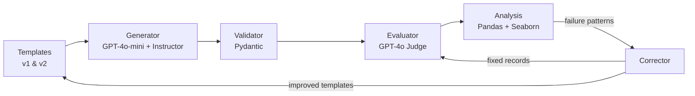

# P1: Synthetic Data Generation — Home DIY Repair

> Automated pipeline for generating, evaluating, and correcting synthetic Q&A data for home DIY repairs using LLM-as-Judge evaluation.

## Problem Statement

High-quality training data is the bottleneck for most AI applications. Manual data creation is slow and expensive; naive LLM generation produces inconsistent quality. This project demonstrates a **closed-loop pipeline** that generates synthetic data, evaluates it with an LLM judge, identifies failure patterns, improves the generation templates, and corrects remaining issues — reducing failures from 20% to 0%.

## Key Results

| Metric | Value |
|--------|-------|
| Records Generated | 30 (5 categories x 3 difficulties x 2 each) |
| V1 Failure Rate | 20.0% (36/180 evaluations) |
| V2 Failure Rate | 4.4% (8/180) — 77.8% reduction |
| Final Rate (V2 + Correction) | **0.0%** — 100% reduction |
| Inter-rater Agreement | 81.7% (LLM judge vs human labels) |

**The 36 → 8 → 0 story:** V1 templates produced 36 failures across 30 records. Analyzing failure patterns revealed `incomplete_answer` (50%) and `poor_quality_tips` (43%) as dominant modes. Improved V2 templates cut failures to 8 (-78%). Targeted correction of remaining 8 brought the total to **0** (-100%).

## Architecture



## Key Decisions (ADRs)

- **[ADR-001](docs/adr/ADR-001-instructor-over-raw-openai.md):** Why Instructor over raw OpenAI API — structured output with auto-retry on validation failure
- **[ADR-002](docs/adr/ADR-002-flat-schema-over-nested-models.md):** Why flat schema matching spec vs nested models — simpler validation, matches requirements exactly
- **[ADR-003](docs/adr/ADR-003-judge-prompt-calibration.md):** LLM-as-Judge prompt calibration — dual labeling (manual + LLM) to measure agreement
- **[ADR-004](docs/adr/ADR-004-template-improvement-correction.md):** Template improvement as correction strategy — upstream fixes outperform downstream patches

## Tech Stack

Python 3.12, Pydantic v2, Instructor, OpenAI (GPT-4o-mini for generation, GPT-4o for evaluation), Pandas, Seaborn, Streamlit

## Quick Start

```bash
# Clone and navigate
git clone https://github.com/rubsj/ai-portfolio.git
cd ai-portfolio/01-synthetic-data-home-diy

# Install dependencies (requires uv)
uv sync

# Run the pipeline
uv run python -m src.generator      # Generate 30 records
uv run python -m src.evaluator      # Run LLM judge
uv run python -m src.analysis       # Generate charts
uv run python -m src.corrector      # Run correction loop

# Launch demo
uv run streamlit run streamlit_app.py
```

> **Note:** Requires an `OPENAI_API_KEY` in `.env` to run generation and evaluation.

## Screenshots

### Dashboard


### Failure Analysis


### Correction Pipeline


## Project Structure

```
01-synthetic-data-home-diy/
├── CLAUDE.md                          # Project-specific Claude Code memory
├── PRD.md                             # Implementation contract
├── pyproject.toml                     # Dependencies
├── streamlit_app.py                   # Interactive demo app
├── src/
│   ├── schemas.py                     # Pydantic models (DIYRepairRecord, JudgeResult, etc.)
│   ├── templates.py                   # 5 prompt templates (v1 and v2)
│   ├── generator.py                   # Instructor-based generation + caching
│   ├── validator.py                   # Validation tracking + rejection logging
│   ├── evaluator.py                   # LLM-as-Judge + agreement analysis
│   ├── corrector.py                   # Individual correction + template improvement
│   └── analysis.py                    # Pandas analysis + chart generation
├── tests/
│   └── test_schemas.py                # Schema validation tests
├── data/
│   ├── cache/                         # LLM response cache (JSON)
│   ├── generated/                     # batch_v1.json, batch_v2.json
│   ├── labels/                        # LLM + manual labels, agreement report
│   └── corrected/                     # Corrected records
├── results/
│   ├── charts/                        # 7 PNG visualizations
│   ├── metrics.json                   # Summary metrics
│   └── correction_comparison.json     # Pipeline stage comparison
└── docs/
    ├── adr/                           # 4 Architecture Decision Records
    └── screenshots/                   # Streamlit app screenshots
```

## What I Learned

- **LLM-as-Judge needs calibration**: Out-of-the-box GPT-4o judging was either too lenient (0 failures) or too strict (20%). Dual labeling with manual ground truth exposed the gap — 81.7% agreement after calibration.
- **Upstream > downstream**: Improving prompt templates (V2) reduced failures by 78%, while individual record correction only achieved 67%. Fixing the source is more effective than patching outputs.
- **Instructor eliminates boilerplate**: Instructor's auto-retry with validation error feedback to the LLM meant 100% generation success rate with zero manual parsing code.
- **Failure modes cluster**: `incomplete_answer` and `poor_quality_tips` accounted for 78% of all failures. `electrical_repair` had 0 failures — its template was already specific enough.
- **Pydantic v2 catches hallucinations**: Field validators (min_length, pattern matching) caught structural issues before they reached evaluation, acting as a first filter.

## Part of AI Portfolio Sprint

This is Project 1 of 9 in an 8-week AI portfolio sprint. See the [full portfolio](../README.md).
