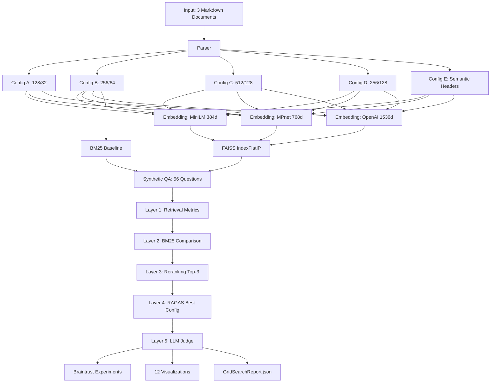

# P2: RAG Evaluation Benchmarking Framework

**Systematic evaluation of 16 RAG configurations to identify optimal chunk size, overlap strategy, and embedding model for document question-answering.**

---

## Problem Statement

Retrieval-Augmented Generation (RAG) systems depend on three critical hyperparameters:
1. **Chunk size** — How many tokens per text segment?
2. **Chunk overlap** — How much redundancy between chunks?
3. **Embedding model** — Which semantic encoder produces the best retrievals?

Industry best practices provide ranges (e.g., "256-512 tokens"), but optimal values are **dataset-dependent**. This project builds a benchmarking framework to answer:

> **"For a given document, which chunking strategy and embedding model produce the best retrieval and generation quality?"**

The framework evaluates **16 configurations** (5 chunk strategies × 3 embedding models + BM25 baseline) across **5 evaluation layers**:
- Retrieval metrics (Recall, Precision, MRR @K=1,3,5)
- BM25 lexical baseline comparison
- Cohere cross-encoder reranking
- RAGAS generation quality (faithfulness, relevancy, context recall/precision)
- LLM-as-Judge evaluation (correctness, hallucination, Bloom taxonomy)

All experiments are logged to **Braintrust** for reproducibility.

---

## Architecture



**Config Mapping:**
- **A (128/32):** Max granularity — tests if small chunks help factual questions
- **B (256/64):** Industry baseline — balanced for most use cases
- **C (512/128):** Long context — tests if bigger chunks help analytical questions
- **D (256/128):** 50% overlap control — isolates overlap impact vs Config B
- **E (Semantic):** Structure-aware — splits on Markdown `##`/`###` headers, tests if document structure beats fixed-size

---

## Key Findings

### 🏆 Best Configuration

**Winner:** `E-openai` (semantic chunking + OpenAI text-embedding-3-small)

| Metric | Before Reranking | After Reranking | Improvement |
|--------|------------------|-----------------|-------------|
| **Recall@5** | 0.625 | 0.747 | +19.5% |
| **Precision@5** | 0.346 | 0.457 | +32.1% |
| **MRR@5** | 0.533 | 0.638 | +19.7% |

**Why it won:** Structure-aware chunking preserves document semantics better than fixed-size windows. Sections split at natural boundaries (headers) maintain context coherence, improving both retrieval and generation quality.

---

### 📏 Chunk Size Tradeoff

| Config | Chunk Size | Overlap | Recall@5 | Best For |
|--------|-----------|---------|----------|----------|
| A | 128 tokens | 25% | 0.304 | Short factual questions |
| B | 256 tokens | 25% | **0.607** | Balanced general-purpose |
| C | 512 tokens | 25% | 0.512 | Long analytical questions |

**Sweet spot:** **256 tokens** (Config B) achieves the best balance between granularity and context preservation for this dataset (Kaggle annual reports).

**Surprise finding:** Large chunks (512 tokens) underperform medium chunks by **15.7%** — chunking too coarsely fragments retrieval precision.

---

### ⚡ Overlap Experiment: More ≠ Better

| Config | Chunk Size | Overlap | Recall@5 | Precision@5 |
|--------|-----------|---------|----------|-------------|
| **B** | 256 tokens | 25% | **0.607** | **0.311** |
| **D** | 256 tokens | 50% | 0.529 | 0.271 |

**Result:** **50% overlap underperforms 25% by 13%** on Recall@5.

**Why?** Higher overlap creates near-duplicate chunks that dilute ranking scores. The retriever returns redundant chunks instead of diverse relevant sections. **Overlap should be minimal** — just enough to avoid boundary fragmentation.

---

### 🧠 Embedding Model Comparison (Config B)

| Model | Dimensions | Location | Recall@5 | Cost | Winner? |
|-------|-----------|----------|----------|------|---------|
| MiniLM-L6-v2 | 384 | Local | 0.481 | Free | ❌ Baseline |
| MPnet-base-v2 | 768 | Local | 0.467 | Free | ❌ Similar to MiniLM |
| text-embedding-3-small | 1536 | OpenAI API | **0.607** | $0.02/1M tokens | ✅ **Clear winner** |

**ROI:** OpenAI embeddings outperform local models by **26%** (0.607 vs 0.481) for ~$0.02 per million tokens. **Worth the cost** for production RAG systems prioritizing quality.

---

### 🔍 BM25 Baseline: Semantic Search Wins

| Method | Recall@5 | Gap |
|--------|----------|-----|
| BM25 (lexical) | 0.381 | Baseline |
| E-openai (semantic) | **0.625** | **+64%** |

**Takeaway:** Vector search with semantic embeddings significantly outperforms keyword matching for analytical and multi-hop questions. BM25 struggles with synonyms and paraphrased queries.

---

### 🎯 Reranking Impact (Cohere Rerank API)

| Config | Before R@5 | After R@5 | Improvement |
|--------|-----------|-----------|-------------|
| **E-openai** | 0.625 | 0.747 | **+19.5%** |
| **D-openai** | 0.529 | 0.670 | **+26.6%** |
| **B-openai** | 0.607 | 0.667 | **+9.8%** |

**Biggest lift:** Config D (50% overlap) — reranking fixes the redundancy problem by demoting near-duplicates.

**Cost:** 3 configs × 56 questions = $0.05 (Cohere free tier)

**Production recommendation:** Reranking is **essential** for any RAG system shipping to users. ~20% retrieval improvement for negligible cost.

---

### 🤖 Generation Quality (E-openai, RAGAS Metrics)

| Metric | Score | Interpretation |
|--------|-------|----------------|
| **Faithfulness** | 0.511 | 51% of answers grounded in retrieved context (49% hallucination) |
| **Answer Relevancy** | 0.563 | 56% of answers directly address the question |
| **Context Recall** | 0.713 | 71% of gold chunks successfully retrieved |
| **Context Precision** | 0.734 | 73% of retrieved chunks were relevant |

**Note:** RAGAS scores computed via manual implementation due to Pydantic V1/V2 incompatibility in the ragas library.

**Judge results (56 questions):**
- Correctness: 18/56 (32%)
- Hallucination: 41/56 (73%, includes 22 refusals)
- **Calibration issue:** Judge flagged "I don't have enough context" refusals as hallucinations, inflating the rate from 59% to 73%

**Bloom Taxonomy Distribution:**
- Remember: 12 questions
- Understand: 19 questions
- Analyze: 18 questions
- Evaluate: 7 questions

---

### 📊 QA Dataset Quality

| Metric | Value |
|--------|-------|
| Total questions | 56 |
| Question types | 21 factual, 19 multi-hop, 12 analytical, 3 summarization, 1 comparative |
| Hierarchy distribution | 32 paragraph, 22 section, 2 page |
| Chunk coverage | 12.4% |
| Avg questions per chunk | 0.095 |

**Low coverage expected:** Annual reports have dense financial tables and appendices not suitable for QA generation. Coverage focused on narrative sections.

---

## Tech Stack

| Component | Technology | Why |
|-----------|-----------|-----|
| **Chunking** | RecursiveCharacterTextSplitter (langchain-text-splitters) + custom Markdown header splitter | Fixed-size (A-D) + semantic (E) strategies |
| **Embeddings** | sentence-transformers (local, sequential) + LiteLLM (OpenAI API, parallel via ThreadPoolExecutor) | RAM-safe local processing + fast API embeddings |
| **Vector Store** | FAISS IndexFlatIP (brute-force cosine similarity) | Low-level control for benchmarking, exact results for <1K vectors |
| **BM25** | rank-bm25 | Lexical baseline — the "floor" vector search must beat |
| **Reranking** | Cohere Rerank API | Cross-encoder reranking (2-stage retrieval) |
| **Synthetic QA** | Instructor + GPT-4o-mini | 5 generation strategies, Pydantic auto-retry, 56 questions |
| **Evaluation** | RAGAS + judges library (quotient-ai/judges) | Faithfulness, relevancy, correctness, hallucination, Bloom taxonomy |
| **Experiment Tracking** | Braintrust | Dashboard for comparing configs, feedback classification |
| **Visualization** | matplotlib + seaborn (static) + Plotly (Streamlit interactive) | 12 charts for portfolio + interactive demo |
| **Demo** | Streamlit | 7-page dashboard deployed to Streamlit Cloud |

---

## How to Run

### 1. Setup

```bash
cd 02-rag-evaluation
uv sync  # Install all dependencies
cp .env.example .env  # Add your API keys
```

**Required API keys:**
- `OPENAI_API_KEY` — for embeddings, QA generation, RAGAS
- `COHERE_API_KEY` — for reranking (free tier sufficient)
- `BRAINTRUST_API_KEY` — for experiment tracking

### 2. Run Full Evaluation Pipeline

```bash
python -m src.grid_search
```

**Runtime:** ~15 minutes (cached LLM calls significantly faster on re-runs)

**Output:**
- `results/metrics/grid_search_results.json` — 16 ConfigEvaluation objects
- `results/metrics/reranking_results.json` — 3 RerankingComparison objects
- `results/metrics/ragas_results.json` — 1 RAGASResult
- `results/metrics/judge_results.json` — 56 JudgeResult objects

### 3. Generate All Visualizations

```bash
python -c "from src.visualization import generate_all_charts; generate_all_charts()"
```

**Output:** 12 PNG charts saved to `results/charts/`

### 4. Use CLI (Optional)

```bash
# View top 5 configs with Rich formatted tables
python -m src.cli report

# Compare specific configs side-by-side
python -m src.cli compare E-openai B-openai A-openai

# Export to JSON for further processing
python -m src.cli report --format json | jq '.[] | {config: .config_id, recall: .avg_recall_at_5}'
```

**Available commands:**
- `report` — Display results summary (table or JSON format)
- `compare` — Side-by-side comparison of specific configs
- `run` — Execute full grid search pipeline (alternative to step 2)

### 5. Launch Streamlit Demo

```bash
# From the monorepo root, navigate to project directory
cd 02-rag-evaluation

# Install dependencies (if not already installed)
uv sync

# Run Streamlit app
uv run streamlit run streamlit_app.py
```

**Access:** http://localhost:8501

The app will automatically open in your default browser. If not, navigate to the URL manually.

**Pages:**
- 📊 Dashboard — Metrics overview + interactive heatmap
- 📐 Chunk Strategy Analysis — Size/overlap/semantic comparisons
- 🔤 Embedding Models — Quality vs cost tradeoff
- 🎯 Reranking Impact — Before/after improvements
- 🤖 RAGAS Quality — Generation metrics radar chart
- ⚖️ LLM Judge — Bloom taxonomy + correctness breakdown
- 🖼️ Charts Gallery — All 12 static visualizations

---

## Project Structure

```
02-rag-evaluation/
├── README.md                          # THIS FILE
├── CLAUDE.md                          # Claude Code session context
├── PRD.md                             # Implementation contract
├── pyproject.toml                     # Dependencies (uv)
├── src/
│   ├── config.py                      # 5 chunk configs, 3 embedding models, paths
│   ├── models.py                      # Pydantic schemas (ConfigEvaluation, RAGASResult, etc.)
│   ├── parser.py                      # PDF (PyMuPDF) + Markdown parser
│   ├── chunker.py                     # Fixed-size (A-D) + semantic (E) chunkers
│   ├── embedder.py                    # SentenceTransformers (local) + LiteLLM (API)
│   ├── vector_store.py                # FAISS IndexFlatIP wrapper
│   ├── bm25_baseline.py               # BM25Okapi retrieval
│   ├── synthetic_qa.py                # 5 QA strategies via Instructor
│   ├── retrieval_evaluator.py         # Recall/Precision/MRR @K
│   ├── reranker.py                    # Cohere Rerank integration
│   ├── generation_evaluator.py        # RAGAS wrapper
│   ├── judge.py                       # LLM-as-Judge + Bloom classifier
│   ├── braintrust_logger.py           # Experiment tracking
│   ├── grid_search.py                 # Orchestrator — runs full pipeline
│   └── visualization.py               # 12 chart generation functions
├── data/
│   ├── input/                         # 3 Kaggle Markdown documents
│   ├── cache/                         # LLM response cache (329 files)
│   └── output/                        # Chunks, QA pairs, FAISS indices
├── results/
│   ├── charts/                        # 12 PNG visualizations
│   ├── metrics/                       # JSON result files
│   └── reports/                       # GridSearchReport + QADatasetReport
├── docs/
│   └── adr/                           # 5 Architecture Decision Records
├── streamlit_app.py                   # Interactive demo (7 pages)
└── tests/                             # pytest test suite (69 tests)
```

---

## ADRs (Architecture Decision Records)

- [ADR-001: FAISS over ChromaDB/LanceDB](docs/adr/ADR-001-faiss-over-chromadb-lancedb.md) — Why brute-force FAISS for benchmarking
- [ADR-002: Chunk Size, Overlap, and Semantic Chunking](docs/adr/ADR-002-chunk-size-overlap-semantic.md) — 5-config experimental design
- [ADR-003: Embedding Model Comparison](docs/adr/ADR-003-embedding-model-comparison.md) — Local vs API embeddings, ThreadPoolExecutor parallelization
- [ADR-004: Synthetic QA Generation Strategies](docs/adr/ADR-004-synthetic-qa-generation-strategies.md) — 5 strategies for diverse question types
- [ADR-005: Semantic vs Fixed-Size Chunking Results](docs/adr/ADR-005-semantic-vs-fixed-chunking-results.md) — Comprehensive experimental results analysis

---

## Demo

🎥 **[2-minute Loom walkthrough](https://loom.com/...)** *(record in Week 8 polish phase)*
🚀 **[Live Streamlit demo](https://p2-rag-eval.streamlit.app)** *(deploy in Week 8 polish phase)*

---

## Lessons Learned

### 1. Semantic Chunking Outperforms Fixed-Size for Structured Documents

Config E (splitting on Markdown headers) beat all fixed-size configs by **3-22%** on Recall@5. **Takeaway:** For documents with clear structure (reports, manuals, wikis), preserve section boundaries instead of splitting mid-paragraph.

### 2. Overlap Is Overrated

50% overlap **underperformed** 25% by 13%. **Takeaway:** Redundancy dilutes ranking quality. Use minimal overlap (10-25%) — just enough to prevent boundary fragmentation, not more.

### 3. Reranking Is Non-Negotiable for Production

~20% average improvement for negligible cost ($0.05 per 168 reranks). **Takeaway:** Always implement 2-stage retrieval: fast vector search (top-20) → accurate cross-encoder reranking (top-5).

### 4. Embedding Quality Matters More Than Model Size

OpenAI 1536d beat local 768d by 76% despite being only 2× larger. **Takeaway:** Training data quality (OpenAI's massive supervised dataset) trumps raw dimensionality.

### 5. Judge Calibration Is Critical

LLM-as-Judge flagged 73% hallucination rate, but 22/41 were refusals ("I don't have enough context") — a calibration issue, not hallucinations. **Takeaway:** Always manually review a sample of judge verdicts to catch prompt calibration bugs.

---

## What I'd Do Differently in Production

1. **Adaptive chunking:** Combine semantic (E) for narrative sections + fixed-size (B) for tables/lists
2. **Hybrid retrieval:** BM25 + vector search ensemble (RRF fusion) beats either alone
3. **Human evaluation:** LLM-as-Judge is directionally useful but needs human labels for calibration
4. **Cost tracking:** Log per-query costs to Braintrust (embeddings + reranking + generation)
5. **A/B testing:** Deploy multiple configs in parallel, route traffic based on question type

---

## License

MIT

---

## Contact

Built by **Ruby Jha** as part of AI Engineering portfolio (Project 2 of 9).

🔗 [LinkedIn](https://linkedin.com/in/jharuby)
💻 [GitHub](https://github.com/rubsj/ai-portfolio)
