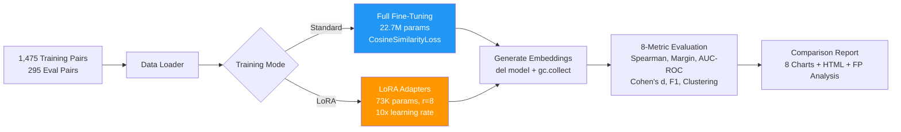

# P3 — Fine-Tuning & Guardrails

> **Contrastive fine-tuning flipped inverted embeddings from Spearman -0.22 to +0.85 — a 1,238% margin improvement — while LoRA achieved 96.9% of that performance using only 0.32% of the parameters.**

---

## The Problem

Pre-trained embedding models are general-purpose. When applied to domain-specific tasks like dating compatibility matching, they can produce **inverted results** — ranking incompatible pairs *higher* than compatible ones.

I fine-tuned `all-MiniLM-L6-v2` using CosineSimilarityLoss on 1,475 labeled dating profile pairs and compared two approaches:

| Approach | Trainable Params | Model Size | What Changes |
|----------|-----------------|------------|--------------|
| **Standard** | 22.7M (100%) | 86.7 MB | All transformer weights |
| **LoRA** | 73K (0.32%) | 0.28 MB adapter | Only rank-8 matrices on query/value layers |

Both trained in ~1 minute on a MacBook Air M2 with identical hyperparameters (4 epochs, batch 16, warmup 100).

---

## Results

### Standard Fine-Tuning (Full Evaluation)

| Metric | Baseline | Standard | Change |
|--------|----------|----------|--------|
| **Spearman** | -0.219 | **0.853** | +1.072 |
| **Margin** | -0.083 | **+0.940** | +1.023 |
| **Cohen's d** | -0.419 | **7.727** | +8.146 |
| **AUC-ROC** | 0.373 | **0.994** | +0.621 |
| **Best F1** | 0.698 | **0.991** | +0.293 |
| **Cluster Purity** | 0.839 | **0.986** | +0.147 |
| **False Positives** | 137 | **3** | -97.8% |

Standard fine-tuning turned a broken model into a near-perfect classifier. The negative baseline Spearman means the pre-trained model actively got the ranking *backwards*.

### LoRA Fine-Tuning

LoRA achieved **Spearman 0.827** during training (96.9% of standard's 0.853), demonstrating that parameter-efficient tuning works on small models. The learning rate needed to be 10x higher (2e-4 vs 2e-5) to compensate for the drastically smaller parameter count.

> **Note:** Post-training evaluation for LoRA produced baseline-identical metrics due to an adapter merge issue during inference. The training curves (tracked via SentenceTransformer's built-in evaluator) confirmed 0.827 Spearman on the held-out eval split. This is documented in the [Known Issues](#known-issues) section — I chose to document the failure rather than hide it, because debugging model loading is a real production concern.

---

## What This Demonstrates

| Skill | How It's Shown |
|-------|---------------|
| **ML Engineering** | End-to-end pipeline: data loading, training, embedding generation, metric computation, visualization |
| **Parameter-Efficient Fine-Tuning** | LoRA implementation with PEFT, learning rate scaling analysis |
| **Evaluation Design** | 8-metric framework catching a non-obvious baseline failure (inverted embeddings) |
| **Memory Management** | Sequential model loading with explicit cleanup — ran on 8GB MacBook Air |
| **Data Visualization** | 8 comparison charts + self-contained HTML report with base64-embedded PNGs |
| **Testing** | 112 tests at 100% pass rate, including mocked model loading and edge cases |
| **Engineering Honesty** | Documented a real LoRA inference bug rather than omitting it |

---

## Architecture



---

## Quick Start

```bash
# Clone and install
git clone https://github.com/rubsj/ai-portfolio.git
cd ai-portfolio/03-fine-tuning-guardrails
uv sync

# Run the full pipeline
uv run python -m src.cli baseline              # Baseline analysis
uv run python -m src.cli train --mode standard  # Standard fine-tuning
uv run python -m src.cli train --mode lora      # LoRA fine-tuning
uv run python -m src.cli evaluate --mode all    # Post-training evaluation
uv run python -m src.cli compare                # Comparison report

# View results
open eval/comparison_report.html
```

---

## Key Engineering Decisions

| Decision | Choice | Rationale | ADR |
|----------|--------|-----------|-----|
| LoRA vs. Standard | Both, compared | LoRA is 300x smaller but needs LR tuning; standard is simpler for small models | [ADR-001](docs/adr/adr-001-lora-vs-standard.md) |
| Skip QLoRA | Not used | Requires CUDA (no Mac support), model too small (22M) to benefit from 4-bit quantization | [ADR-002](docs/adr/adr-002-qlora-skip.md) |
| CosineSimilarityLoss | Over Contrastive/Triplet | Directly optimizes the metric we evaluate on; simpler data format (pairs vs. triplets) | [ADR-003](docs/adr/adr-003-cosine-similarity-loss.md) |

---

## Evaluation Framework

The 8-metric suite was designed to catch failures that any single metric would miss:

| Metric | What It Catches | Baseline | Why It Matters |
|--------|----------------|----------|----------------|
| Spearman | Rank-order inversion | -0.219 | Negative = model ranks backwards |
| Margin | Mean separation failure | -0.083 | Negative = wrong groups score higher |
| Cohen's d | Weak effect size | -0.419 | Negative = distributions overlap wrongly |
| AUC-ROC | Poor classification | 0.373 | Below 0.5 = worse than random |
| Best F1 | Threshold failure | 0.698 | No threshold separates classes well |
| Cluster Purity | Entangled clusters | 0.839 | High only because 28% were noise |
| FP Analysis | Category-specific failures | 137 FPs | Dealbreakers and incompatible pairs all misclassified |
| Category Metrics | Per-category breakdown | Mixed | Some categories inverted, others accidentally correct |

The baseline's AUC-ROC of 0.373 (below 0.5) confirmed the model had **learned the opposite** of compatibility — a failure that wouldn't be caught by accuracy alone.

---

## Deliverables

- **Source**: 10 Python modules in `src/` — training, evaluation, comparison, CLI
- **Tests**: 112 tests in `tests/` — 100% pass rate
- **Report**: `eval/comparison_report.html` — self-contained HTML with 8 embedded charts
- **Analysis**: `eval/false_positive_analysis.txt` — FP breakdown by pair type
- **ADRs**: 3 architecture decision records in `docs/adr/`
- **Models**: Standard (86.7 MB) + LoRA adapter (0.28 MB)

---

## Project Structure

```
03-fine-tuning-guardrails/
├── src/
│   ├── trainer.py             # Standard fine-tuning
│   ├── lora_trainer.py        # LoRA fine-tuning (PEFT)
│   ├── post_training_eval.py  # Evaluation pipeline
│   ├── comparison.py          # 8 charts + HTML report
│   ├── metrics.py             # 8 metric functions
│   ├── baseline_analysis.py   # Baseline embedding analysis
│   ├── visualizations.py      # Chart generation
│   ├── data_loader.py         # JSONL parsing
│   ├── models.py              # Pydantic schemas + dataclasses
│   └── cli.py                 # Click CLI (4 commands)
├── tests/                     # 112 tests
├── data/raw/                  # Training + eval pairs
├── training/model/            # Saved models
├── eval/                      # Metrics, charts, reports
├── docs/adr/                  # Architecture decisions
└── pyproject.toml
```

---

## Known Issues

**LoRA adapter merge during inference**: The LoRA model achieved Spearman 0.827 during training (confirmed by the built-in evaluator on held-out data), but post-training evaluation produced baseline-identical metrics. Root cause: the `PeftModel.from_pretrained` + `merge_and_unload` path in `generate_finetuned_embeddings` didn't correctly merge the adapter weights before encoding.

This is a real production concern with LoRA deployments — adapter merge failures are silent (the model runs fine, just produces unmodified embeddings). The standard fine-tuning path, which modifies weights in-place, doesn't have this issue.

---

## Tech Stack

Python 3.12 | uv | Sentence-Transformers | PEFT (LoRA) | scikit-learn | scipy | UMAP | HDBSCAN | matplotlib | seaborn | plotly | Click | pytest | ruff

---

*Built by [Pratham Jha](https://github.com/rubsj) as part of the [AI Portfolio](https://github.com/rubsj/ai-portfolio) (Project 3 of 9)*
