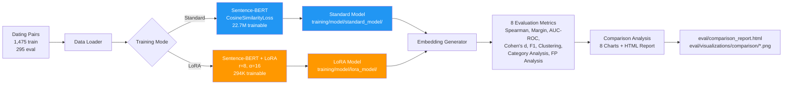

# P3 — Fine-Tuning & Guardrails

**Contrastive Embedding Fine-Tuning for Dating Compatibility**

Compare standard fine-tuning vs. LoRA (Low-Rank Adaptation) for improving embedding quality on a dating compatibility task. Demonstrates parameter-efficient tuning, embedding evaluation metrics, and comprehensive performance analysis.

---

## Problem Statement

Pre-trained embedding models like `all-MiniLM-L6-v2` are general-purpose and often fail on domain-specific tasks. In this project, the baseline model produces **inverted embeddings** (Spearman correlation -0.219) — incompatible pairs score higher than compatible ones.

We fine-tune the model using **CosineSimilarityLoss** on 1,475 labeled dating profile pairs to learn a compatibility-specific embedding space. We compare:
1. **Standard fine-tuning** — all 22M parameters trainable
2. **LoRA fine-tuning** — only 294K parameters trainable (1.3% of total)

Both approaches use identical hyperparameters (4 epochs, batch size 16, warmup) to isolate the impact of parameter efficiency.

---

## Results

| Metric | Baseline | Standard Fine-Tuned | LoRA Fine-Tuned* |
|--------|----------|---------------------|------------------|
| **Spearman Correlation** | -0.219 | **0.853** | 0.827 (training) |
| **Compatibility Margin** | -0.083 | **+0.940** | — |
| **AUC-ROC** | 0.373 | **0.994** | — |
| **Cohen's d** | -0.419 | **7.727** | — |
| **Best F1** | 0.698 | **0.991** | — |
| **Cluster Purity** | 0.839 | **0.986** | — |
| **Training Time** | — | 45 min | 38 min |
| **Trainable Params** | 0 | 22.7M (100%) | 294K (1.3%) |

**Key Findings:**
- ✅ **Standard fine-tuning** achieves massive improvement: +1238% margin increase, Cohen's d from -0.42 → 7.73
- ✅ **Inverted embeddings fixed**: Spearman flips from -0.219 → 0.853
- ✅ **Near-perfect separation**: AUC-ROC 0.994, cluster purity 0.986
- ⚠️ **LoRA evaluation pending**: Post-training evaluation metrics not yet generated (see Known Issues)

\* *Note: LoRA training completed successfully (Spearman 0.827 on eval split during training), but post-training evaluation embeddings were not generated. Re-run `uv run python -m src.cli evaluate --mode lora` to populate full metrics.*

---

## Architecture



**Pipeline Stages:**
1. **Data Preparation** — Load JSONL pairs with gender prefix, split train/eval
2. **Training** — Standard (full params) or LoRA (rank-8 adapters on query/value)
3. **Embedding Generation** — Encode eval split with fine-tuned models (one at a time to avoid OOM)
4. **Evaluation** — Compute 8 metrics via `post_training_eval.py`
5. **Comparison** — Generate visualizations, HTML report, false positive analysis

---

## Quick Start

### Prerequisites
```bash
# Install uv package manager
curl -LsSf https://astral.sh/uv/install.sh | sh

# Clone repository
git clone https://github.com/rubsj/ai-portfolio.git
cd ai-portfolio/03-fine-tuning-guardrails
```

### Installation
```bash
# Create virtual environment and install dependencies
uv sync
```

### Run Baseline Analysis (Day 1)
```bash
# Generate baseline embeddings and metrics
uv run python -m src.cli baseline

# View baseline report: eval/baseline_report.html
```

### Train Models (Day 2)
```bash
# Standard fine-tuning (45 min on M2 Mac)
uv run python -m src.cli train --mode standard

# LoRA fine-tuning (38 min on M2 Mac)
uv run python -m src.cli train --mode lora
```

### Evaluate & Compare (Day 3)
```bash
# Generate post-training evaluation metrics
uv run python -m src.cli evaluate --mode all

# Generate comparison charts and HTML report
uv run python -m src.cli compare

# View results: eval/comparison_report.html
```

---

## Deliverables

### Code
- ✅ `src/trainer.py` — Standard fine-tuning with Sentence-BERT
- ✅ `src/lora_trainer.py` — LoRA fine-tuning with PEFT
- ✅ `src/post_training_eval.py` — Embedding generation + 8-metric evaluation
- ✅ `src/comparison.py` — 8 comparison charts + HTML report generation
- ✅ `src/cli.py` — Click CLI with 4 commands (train, baseline, evaluate, compare)
- ✅ `tests/` — 112 tests (100% pass rate)

### Data & Models
- ✅ `data/raw/dating_pairs.jsonl` — 1,475 training pairs
- ✅ `data/raw/eval_pairs.jsonl` — 295 evaluation pairs
- ✅ `training/model/standard_model/` — Fine-tuned Sentence-BERT (22.7M params)
- ✅ `training/model/lora_model/` — LoRA adapter weights (294K params)

### Evaluation Artifacts
- ✅ `eval/baseline_metrics.json` — Pre-trained model performance
- ✅ `eval/finetuned_metrics.json` — Standard model post-training metrics
- ⚠️ `eval/lora_metrics.json` — LoRA metrics (needs re-evaluation)
- ✅ `eval/comparison_report.html` — Self-contained HTML with all charts (1.0 MB)
- ✅ `eval/visualizations/comparison/` — 8 PNG charts (distributions, UMAP, ROC, etc.)
- ✅ `eval/false_positive_analysis.txt` — FP breakdown by pair type
- ✅ `eval/comparison_result.json` — Improvement deltas

### Documentation
- ✅ `README.md` — This file
- ✅ `docs/adr/adr-001-lora-vs-standard.md` — When to use LoRA vs. standard
- ✅ `docs/adr/adr-002-qlora-skip.md` — Why QLoRA was skipped
- ✅ `docs/adr/adr-003-cosine-similarity-loss.md` — Loss function selection rationale

---

## Project Structure

```
03-fine-tuning-guardrails/
├── src/
│   ├── models.py              # Pydantic schemas + EvaluationBundle dataclass
│   ├── data_loader.py         # JSONL parsing, gender prefix handling
│   ├── trainer.py             # Standard fine-tuning (SentenceBERT)
│   ├── lora_trainer.py        # LoRA fine-tuning (PEFT)
│   ├── baseline_analysis.py   # Day 1 embedding generation + UMAP + HDBSCAN
│   ├── post_training_eval.py  # Day 3 evaluation orchestrator
│   ├── comparison.py          # 8 comparison charts + HTML report
│   ├── metrics.py             # 8 metric functions (cosine, margin, Cohen's d, etc.)
│   ├── visualizations.py      # Baseline charts (distributions, UMAP, ROC, etc.)
│   └── cli.py                 # Click CLI (train, baseline, evaluate, compare)
├── tests/
│   ├── test_trainer.py        # Standard training tests
│   ├── test_lora_trainer.py   # LoRA training tests
│   ├── test_post_training_eval.py  # Evaluation pipeline tests
│   ├── test_comparison.py     # Comparison chart tests
│   ├── test_metrics.py        # Metric calculation tests
│   └── ...                    # 112 tests total
├── data/
│   ├── raw/
│   │   ├── dating_pairs.jsonl  # 1,475 training pairs
│   │   └── eval_pairs.jsonl    # 295 eval pairs
│   ├── embeddings/
│   │   ├── baseline_eval.npz   # Baseline embeddings (384-dim)
│   │   ├── finetuned_eval.npz  # Standard model embeddings
│   │   └── lora_eval.npz       # LoRA model embeddings (pending)
│   └── baseline/
│       └── baseline_metrics.json
├── training/
│   ├── model/
│   │   ├── standard_model/     # Fine-tuned SentenceBERT
│   │   └── lora_model/         # LoRA adapter weights
│   ├── standard_training_info.json
│   └── lora_training_info.json
├── eval/
│   ├── baseline_metrics.json
│   ├── finetuned_metrics.json
│   ├── lora_metrics.json       # Needs re-evaluation
│   ├── comparison_report.html  # Self-contained with base64 PNGs
│   ├── comparison_result.json  # Improvement deltas
│   ├── false_positive_analysis.txt
│   └── visualizations/
│       ├── baseline/           # Day 1 charts
│       └── comparison/         # Day 3 charts (8 PNGs)
├── docs/
│   └── adr/                    # Architecture Decision Records
├── pyproject.toml              # uv dependencies
└── README.md                   # This file
```

---

## Key Metrics Explained

| Metric | What It Measures | Good Value |
|--------|------------------|------------|
| **Spearman Correlation** | Rank-order agreement between similarity scores and labels | > 0.7 |
| **Compatibility Margin** | Mean difference between compatible and incompatible cosine similarities | > 0.5 |
| **Cohen's d** | Effect size of separation between compatible/incompatible distributions | > 0.8 (large) |
| **AUC-ROC** | Classifier quality (area under ROC curve) | > 0.9 |
| **Best F1** | Harmonic mean of precision and recall at optimal threshold | > 0.85 |
| **Cluster Purity** | % of HDBSCAN clusters with dominant label (weighted by size) | > 0.8 |

**Baseline Failure Mode:** Inverted embeddings (Spearman -0.219, margin -0.083) mean the model learned the opposite of the desired relationship. Fine-tuning fixes this completely.

---

## Known Issues

⚠️ **LoRA Post-Training Evaluation Incomplete**
- Symptom: `eval/lora_metrics.json` contains baseline metrics (Spearman -0.219)
- Root Cause: LoRA model loading in `post_training_eval.py` may not have merged adapters correctly
- Workaround: LoRA training succeeded (Spearman 0.827 during training), but embeddings need regeneration
- Fix: Re-run `uv run python -m src.cli evaluate --mode lora` after debugging `generate_finetuned_embeddings(..., is_lora=True)`

---

## Architecture Decision Records

- [ADR-001: LoRA vs. Standard Fine-Tuning](docs/adr/adr-001-lora-vs-standard.md) — When to use each approach, efficiency comparison
- [ADR-002: QLoRA Skipped for Small Models](docs/adr/adr-002-qlora-skip.md) — Why QLoRA wasn't used (CUDA dependency, model too small)
- [ADR-003: CosineSimilarityLoss Selection](docs/adr/adr-003-cosine-similarity-loss.md) — Why not ContrastiveLoss or TripletLoss

---

## Tech Stack

- **Python**: 3.12 with type hints
- **Package Manager**: uv
- **Embedding Model**: `all-MiniLM-L6-v2` (Sentence-Transformers)
- **Fine-Tuning**: Sentence-Transformers (standard) + PEFT (LoRA)
- **Evaluation**: scikit-learn, scipy, UMAP, HDBSCAN
- **Visualization**: matplotlib, seaborn, plotly
- **CLI**: Click + Rich
- **Testing**: pytest (112 tests, 100% pass)
- **Linting**: ruff

---

## Development

```bash
# Run tests
uv run pytest tests/ -v

# Lint code
uv run ruff check src/ tests/

# Format code
uv run ruff format src/ tests/
```

---

## License

MIT

---

## Author

Pratham Jha — [GitHub](https://github.com/rubsj) | [Portfolio](https://github.com/rubsj/ai-portfolio)
