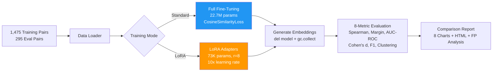

# P3: Contrastive Embedding Fine-Tuning

I fine-tuned `all-MiniLM-L6-v2` on 1,475 dating profile pairs and flipped Spearman from -0.22 to +0.85. LoRA got 96.9% of that using 0.32% of the parameters. 3 ADRs, 112 tests, 8 evaluation charts.


**Sample output:** [`eval/comparison_report.html`](eval/comparison_report.html) (self-contained HTML with 8 embedded charts. Clone the repo and open locally.)

<p align="center">
  
</p>

Cosine similarity distributions before (left) and after (right) fine-tuning. Baseline distributions overlap completely. Fine-tuned distributions separate.

## What Went Wrong with the Baseline

`all-MiniLM-L6-v2` ranked incompatible dating profiles *higher* than compatible ones. Spearman was -0.22 on 295 eval pairs. AUC-ROC was 0.37 (below coin-flip). The model had learned the opposite of compatibility, and a single accuracy metric would not have caught it.

## Results

I evaluated with 8 metrics (Spearman, margin, Cohen's d, AUC-ROC, F1, cluster purity, false positive analysis, category breakdown) so no single metric could mask a failure. Two training approaches, identical hyperparameters (4 epochs, batch 16, warmup 100), both under 1 minute on a MacBook Air M2.

**Standard fine-tuning** modified all 22.7M parameters (86.7 MB model). **LoRA** modified 73K parameters (0.32%) via rank-8 adapters on query/value layers, stored as a 0.28 MB adapter file.

| Metric | Baseline | Standard Fine-Tuned |
|--------|----------|-------------------|
| Spearman | -0.219 | 0.853 |
| Margin | -0.083 | +0.940 |
| Cohen's d | -0.419 | 7.727 |
| AUC-ROC | 0.373 | 0.994 |
| Best F1 | 0.698 | 0.991 |
| Cluster Purity | 0.839 | 0.986 |
| False Positives | 137 | 3 |

LoRA hit Spearman 0.827 during training (96.9% of standard). It needed 10x higher learning rate (2e-4 vs 2e-5) to compensate for the smaller parameter count. Without that adjustment, training stalled.

### LoRA Adapter Merge Bug

LoRA's post-training evaluation produced baseline-identical metrics. The training curves (via SentenceTransformer's built-in evaluator) confirmed 0.827 on held-out data, so the model learned correctly. The bug is in the `PeftModel.from_pretrained` + `merge_and_unload` path in `generate_finetuned_embeddings`: adapter weights did not merge before encoding.

This is a silent failure. The model runs without errors but produces unmodified embeddings. Standard fine-tuning (which modifies weights in-place) does not have this problem.

<p align="center">
  
</p>

### Embedding Space Before/After

<p align="center">
  
</p>

Baseline embeddings overlap with no compatibility structure. Fine-tuned embeddings separate cleanly.

## What's Next

The embedding space is clean, but a single vector similarity score still collapses multiple compatibility dimensions into one number. The next integration is a reranking stage (like the Cohere cross-encoder from P2) to catch edge cases the embedding alone misses.

The 8-metric suite works for a one-shot comparison. In a deployed system, embedding quality degrades as user profiles drift. I'm building a scheduled re-eval on a held-out sample that triggers retraining when metrics drop below thresholds.

The LoRA adapter merge bug has a known fix: `merge_and_unload()` needs to be called on the PeftModel *before* passing it to the SentenceTransformer encoding path. I'm adding an integration test that compares adapter-merged output against standard fine-tuned output on a known input pair. If the cosine similarity between the two outputs drops below a threshold, the merge failed.

For models larger than ~100M parameters, LoRA becomes the only practical option. The 10x learning rate scaling I found here is the starting point, but larger models need different ratios. Next round of experiments sweeps LR as a hyperparameter rather than hardcoding it.

## Architecture


```mermaid
flowchart LR
    A[1,475 Training Pairs<br/>295 Eval Pairs] --> B[Data Loader]
    B --> C{Training Mode}

    C -->|Standard| D[Full Fine-Tuning<br/>22.7M params<br/>CosineSimilarityLoss]
    C -->|LoRA| E[LoRA Adapters<br/>73K params, r=8<br/>10x learning rate]

    D --> F[Generate Embeddings<br/>del model + gc.collect]
    E --> F

    F --> G[8-Metric Evaluation<br/>Spearman, Margin, AUC-ROC<br/>Cohen's d, F1, Clustering]

    G --> H[Comparison Report<br/>8 Charts + HTML + FP Analysis]

    style D fill:#2196F3,color:#fff
    style E fill:#FF9800,color:#fff
```

The comparison report is a self-contained HTML file with 8 base64-encoded charts. No dependencies to view it.

### Decisions

| ADR | Decision | Trade-off |
|-----|----------|-----------|
| [ADR-001](docs/adr/adr-001-lora-vs-standard.md) | Both LoRA and standard, compared | LoRA is 300x smaller but needs LR tuning. Standard is simpler for a 22M-param model. I wanted the comparison data. |
| [ADR-002](docs/adr/adr-002-qlora-skip.md) | Skip QLoRA | Requires CUDA (no Mac support). Model too small to benefit from 4-bit quantization. |
| [ADR-003](docs/adr/adr-003-cosine-similarity-loss.md) | CosineSimilarityLoss over Contrastive/Triplet | Directly optimizes the metric I evaluate on. Simpler data format (pairs vs. triplets). |

## Working Within

8GB RAM on M2. I cannot load the training model and evaluation model simultaneously. The pipeline loads models sequentially with explicit `del model + gc.collect()` between stages. Without this, the process gets OOM-killed mid-evaluation.

1,475 training pairs. Small dataset by fine-tuning standards. Four epochs was the sweet spot. More epochs started overfitting.

No CUDA. MacBook Air M2 means CPU-only training. Training times (~1 minute) are CPU-bound and not representative of GPU performance.

## Tech Stack

| Component | Library | Why this one |
|-----------|---------|-------------|
| Base model | all-MiniLM-L6-v2 (sentence-transformers) | 22M params, fast enough to full-fine-tune on CPU. Widely used baseline for embedding benchmarks. |
| Fine-tuning | Sentence-Transformers + CosineSimilarityLoss | Native support for contrastive training on pairs. No triplet mining needed. |
| LoRA | PEFT (Hugging Face) | Rank-8 adapters on query/value layers. 0.28 MB adapter file. |
| Evaluation metrics | scikit-learn, scipy | Spearman, AUC-ROC, F1, Cohen's d, cluster purity. scipy for rank correlation, sklearn for everything else. |
| Clustering | UMAP + HDBSCAN | UMAP for 2D projection of embedding space. HDBSCAN for density-based cluster purity measurement. |
| Visualization | Matplotlib, Seaborn, Plotly | Static PNGs (Matplotlib/Seaborn) for the README. Plotly for the self-contained HTML comparison report. |
| Infrastructure | Python 3.12, uv, Click CLI, pytest (112 tests), ruff | uv for fast dependency resolution. Click for the 4-command CLI. ruff for linting. |

## Quick Start

```bash
git clone https://github.com/rubsj/ai-portfolio.git
cd ai-portfolio/03-fine-tuning-guardrails
uv sync
```

Run the pipeline:

```bash
uv run python -m src.cli baseline              # Baseline analysis
uv run python -m src.cli train --mode standard  # Standard fine-tuning
uv run python -m src.cli train --mode lora      # LoRA fine-tuning
uv run python -m src.cli evaluate --mode all    # Post-training evaluation
uv run python -m src.cli compare               # Comparison report
```

Open `eval/comparison_report.html` to see results.

## Known Gaps

- **One domain tested.** Dating compatibility profiles with clear category labels. On unstructured text (job descriptions, product reviews), the same contrastive approach may need more data or different loss functions.
- **295 eval pairs.** Enough to show the inversion and confirm the fix, but confidence intervals are wide. Production evaluation needs 1,000+ pairs with human-verified labels.
- **No hyperparameter sweep.** 4 epochs, batch 16, warmup 100 based on sentence-transformers defaults and one manual round of tuning. A proper sweep over learning rate, batch size, and epoch count likely finds a better configuration.
- **LoRA eval is incomplete.** Training metrics confirm 0.827 Spearman, but post-training evaluation is blocked by the adapter merge bug. The LoRA comparison is based on training curves, not the full 8-metric suite.
- **Upstream-beats-downstream is one data point.** The pattern from P1 (fixing upstream beats downstream post-processing) held here too, but two projects is a hypothesis, not a trend.

---

Part of [AI Portfolio Sprint](../README.md). 9 projects, 8 weeks.

Built by **Ruby Jha** · [Portfolio Site](https://rubyjha.dev) · [LinkedIn](https://linkedin.com/in/jharuby) · [GitHub](https://github.com/rubsj/ai-portfolio)
