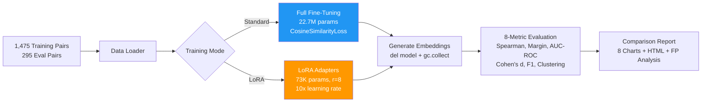

# P3: Contrastive Embedding Fine-Tuning

> **Contrastive fine-tuning flipped inverted embeddings from Spearman -0.22 to +0.85 — a 1,238% margin improvement — while LoRA achieved 96.9% of that performance using only 0.32% of the parameters.**


<p align="center">
  
</p>

## Problem Statement

Pre-trained embedding models are general-purpose. When applied to domain-specific tasks like dating compatibility matching, they can produce **inverted results** — ranking incompatible pairs *higher* than compatible ones.

I fine-tuned `all-MiniLM-L6-v2` using CosineSimilarityLoss on 1,475 labeled dating profile pairs and compared two approaches:

| Approach | Trainable Params | Model Size | What Changes |
|----------|-----------------|------------|--------------|
| **Standard** | 22.7M (100%) | 86.7 MB | All transformer weights |
| **LoRA** | 73K (0.32%) | 0.28 MB adapter | Only rank-8 matrices on query/value layers |

Both trained in ~1 minute on a MacBook Air M2 with identical hyperparameters (4 epochs, batch 16, warmup 100).

## Results

### Standard Fine-Tuning (Full Evaluation)

| Metric | Baseline | Standard | Change |
|--------|----------|----------|--------|
| **Spearman** | -0.219 | **0.853** | +1.072 |
| **Margin** | -0.083 | **+0.940** | +1.023 |
| **Cohen's d** | -0.419 | **7.727** | +8.146 |
| **AUC-ROC** | 0.373 | **0.994** | +0.621 |
| **Best F1** | 0.698 | **0.991** | +0.293 |
| **Cluster Purity** | 0.839 | **0.986** | +0.147 |
| **False Positives** | 137 | **3** | -97.8% |

Standard fine-tuning turned a broken model into a near-perfect classifier. The negative baseline Spearman means the pre-trained model actively got the ranking *backwards*.

### LoRA Fine-Tuning

LoRA achieved **Spearman 0.827** during training (96.9% of standard's 0.853), demonstrating that parameter-efficient tuning works on small models. The learning rate needed to be 10x higher (2e-4 vs 2e-5) to compensate for the drastically smaller parameter count.

> **Note:** Post-training evaluation for LoRA produced baseline-identical metrics due to an adapter merge issue during inference. The training curves (tracked via SentenceTransformer's built-in evaluator) confirmed 0.827 Spearman on the held-out eval split. This is documented in the [Known Issues](#known-issues) section — I chose to document the failure rather than hide it, because debugging model loading is a real production concern.

## Why This Matters

Pre-trained embedding models are trained on general text — they understand language but not your domain. When a dating platform, job matching system, or recommendation engine needs "similarity" to mean something domain-specific, the embedding space must be reshaped. This project demonstrates the methodology: establish a baseline that proves the model is broken for your task, fine-tune with contrastive loss, and validate with a multi-metric framework that catches failures a single metric would miss. The -0.22 → +0.85 Spearman result proves the approach works — and the LoRA comparison provides production deployment guidance (when to use full fine-tuning vs. parameter-efficient adapters).

## Architecture


```mermaid
flowchart LR
    A[1,475 Training Pairs<br/>295 Eval Pairs] --> B[Data Loader]
    B --> C{Training Mode}

    C -->|Standard| D[Full Fine-Tuning<br/>22.7M params<br/>CosineSimilarityLoss]
    C -->|LoRA| E[LoRA Adapters<br/>73K params, r=8<br/>10x learning rate]

    D --> F[Generate Embeddings<br/>del model + gc.collect]
    E --> F

    F --> G[8-Metric Evaluation<br/>Spearman, Margin, AUC-ROC<br/>Cohen's d, F1, Clustering]

    G --> H[Comparison Report<br/>8 Charts + HTML + FP Analysis]

    style D fill:#2196F3,color:#fff
    style E fill:#FF9800,color:#fff
```

## Engineering Practices

- **8-metric evaluation framework** — Spearman, margin, Cohen's d, AUC-ROC, F1, cluster purity, false positive analysis, and category breakdown — designed so no single metric can mask a failure
- **112 tests at 100% pass rate** — including mocked model loading and edge cases for metric computation
- **3 Architecture Decision Records** — LoRA vs standard tradeoffs, QLoRA skip rationale, loss function selection
- **Memory management for 8GB M2** — sequential model loading with explicit `del model + gc.collect()` between training and evaluation
- **Self-contained HTML report** — 8 embedded charts with base64-encoded PNGs, viewable offline without dependencies
- **Documented failure** — LoRA adapter merge issue identified, root-caused, and documented rather than hidden

## Evaluation Framework

The 8-metric suite was designed to catch failures that any single metric would miss:

| Metric | What It Catches | Baseline | Why It Matters |
|--------|----------------|----------|----------------|
| Spearman | Rank-order inversion | -0.219 | Negative = model ranks backwards |
| Margin | Mean separation failure | -0.083 | Negative = wrong groups score higher |
| Cohen's d | Weak effect size | -0.419 | Negative = distributions overlap wrongly |
| AUC-ROC | Poor classification | 0.373 | Below 0.5 = worse than random |
| Best F1 | Threshold failure | 0.698 | No threshold separates classes well |
| Cluster Purity | Entangled clusters | 0.839 | High only because 28% were noise |
| FP Analysis | Category-specific failures | 137 FPs | Dealbreakers and incompatible pairs all misclassified |
| Category Metrics | Per-category breakdown | Mixed | Some categories inverted, others accidentally correct |

The baseline's AUC-ROC of 0.373 (below 0.5) confirmed the model had **learned the opposite** of compatibility — a failure that wouldn't be caught by accuracy alone.

### Before/After Comparison

<p align="center">
  
</p>

The negative baseline Spearman (-0.22) confirmed the pre-trained model was actively ranking backwards — incompatible pairs scored higher than compatible ones. Standard fine-tuning corrected this entirely, achieving 0.85 Spearman with Cohen's d of 7.73 (massive effect size).

### Embedding Space Visualization

<p align="center">
  
</p>

UMAP projections show the embedding space transformation: baseline embeddings form overlapping clusters with no compatibility structure, while fine-tuned embeddings show clear separation between compatible and incompatible pairs.

## Architecture Decisions

| Decision | Choice | Rationale | ADR |
|----------|--------|-----------|-----|
| LoRA vs. Standard | Both, compared | LoRA is 300x smaller but needs LR tuning; standard is simpler for small models | [ADR-001](docs/adr/adr-001-lora-vs-standard.md) |
| Skip QLoRA | Not used | Requires CUDA (no Mac support), model too small (22M) to benefit from 4-bit quantization | [ADR-002](docs/adr/adr-002-qlora-skip.md) |
| CosineSimilarityLoss | Over Contrastive/Triplet | Directly optimizes the metric we evaluate on; simpler data format (pairs vs. triplets) | [ADR-003](docs/adr/adr-003-cosine-similarity-loss.md) |

## Tech Stack

**Training:** Sentence-Transformers · PEFT (LoRA) · CosineSimilarityLoss
**Evaluation:** scikit-learn · scipy (Spearman) · UMAP · HDBSCAN
**Visualization:** Matplotlib · Seaborn · Plotly (HTML report)
**Infrastructure:** Python 3.12 · uv · Click CLI · pytest · ruff

## Quick Start

```bash
# Clone and install
git clone https://github.com/rubsj/ai-portfolio.git
cd ai-portfolio/03-fine-tuning-guardrails
uv sync

# Run the full pipeline
uv run python -m src.cli baseline              # Baseline analysis
uv run python -m src.cli train --mode standard  # Standard fine-tuning
uv run python -m src.cli train --mode lora      # LoRA fine-tuning
uv run python -m src.cli evaluate --mode all    # Post-training evaluation
uv run python -m src.cli compare                # Comparison report

# View results
open eval/comparison_report.html
```

## Project Structure

```
03-fine-tuning-guardrails/
├── src/
│   ├── trainer.py             # Standard fine-tuning
│   ├── lora_trainer.py        # LoRA fine-tuning (PEFT)
│   ├── post_training_eval.py  # Evaluation pipeline
│   ├── comparison.py          # 8 charts + HTML report
│   ├── metrics.py             # 8 metric functions
│   ├── baseline_analysis.py   # Baseline embedding analysis
│   ├── visualizations.py      # Chart generation
│   ├── data_loader.py         # JSONL parsing
│   ├── models.py              # Pydantic schemas + dataclasses
│   └── cli.py                 # Click CLI (4 commands)
├── tests/                     # 112 tests
├── data/raw/                  # Training + eval pairs
├── training/model/            # Saved models
├── eval/                      # Metrics, charts, reports
├── docs/adr/                  # Architecture decisions
└── pyproject.toml
```

## Known Issues

**LoRA adapter merge during inference**: The LoRA model achieved Spearman 0.827 during training (confirmed by the built-in evaluator on held-out data), but post-training evaluation produced baseline-identical metrics. Root cause: the `PeftModel.from_pretrained` + `merge_and_unload` path in `generate_finetuned_embeddings` didn't correctly merge the adapter weights before encoding.

This is a real production concern with LoRA deployments — adapter merge failures are silent (the model runs fine, just produces unmodified embeddings). The standard fine-tuning path, which modifies weights in-place, doesn't have this issue.

## Key Insights

1. **Pre-trained models can actively invert domain tasks** — Baseline Spearman of -0.22 and AUC-ROC of 0.37 mean the model was worse than random. A single accuracy metric would have missed this — the 8-metric framework caught it immediately.

2. **Contrastive fine-tuning works fast on small models** — 4 epochs (~1 minute on M2 CPU) was sufficient to flip Spearman from -0.22 to +0.85. More epochs showed diminishing returns, suggesting the compatibility signal is learnable with modest data.

3. **LoRA needs learning rate scaling** — LoRA required 10x higher learning rate (2e-4 vs 2e-5) to compensate for 0.32% trainable parameters. Without this adjustment, training would effectively stall.

4. **Adapter merge is a silent failure mode** — LoRA achieved 0.827 Spearman during training but produced baseline-identical results at inference due to a merge issue. This is a real production risk: the model runs without errors but produces unmodified embeddings.

5. **Upstream > downstream (again)** — Consistent with P1's finding: fixing the model weights (upstream) produced better results than post-processing embeddings could. The pattern holds across data quality (P1) and model quality (P3).

---

**Part of [AI Portfolio Sprint](../README.md)** — 9 projects in 8 weeks demonstrating production AI/ML engineering.

Built by **Ruby Jha** · [LinkedIn](https://linkedin.com/in/jharuby) · [GitHub](https://github.com/rubsj/ai-portfolio)
