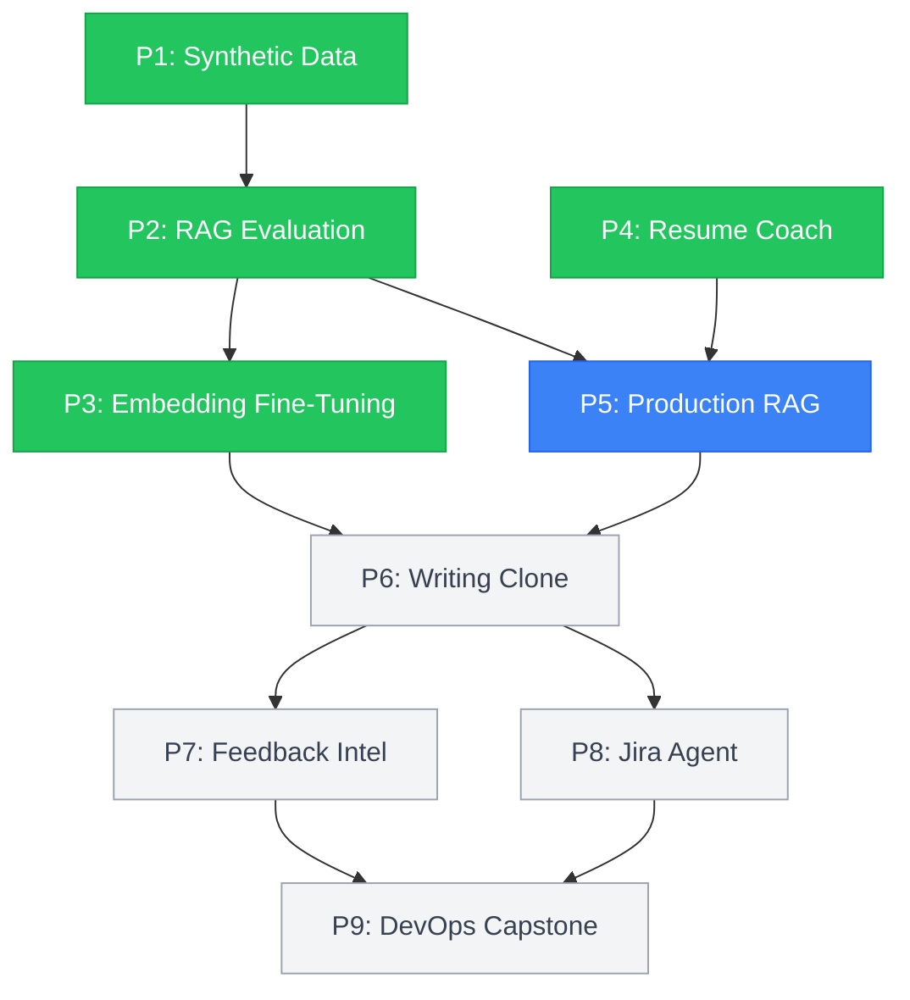

# AI/ML Engineering Portfolio

Nine production-grade AI systems built end-to-end in 8 weeks (Feb-Apr 2026). Not API wrappers — each project solves a real engineering problem with measurable outcomes, reproducible from committed code.

[LinkedIn](https://linkedin.com/in/jharuby) · [Portfolio Site](https://rubyjha.dev)

## Completed Projects

### P1: Closed-Loop Synthetic Data Pipeline

Generates synthetic training data, validates with a 5-layer pipeline (schema, semantic, LLM-as-Judge, correction, re-evaluation), and measures what broke. Upstream template improvement cut failures by 78%, individual correction only managed 67%.

**Result:** 36 failures → 0 across 4-stage correction pipeline · 81.7% inter-rater agreement

`Python` `Pydantic` `OpenAI` `Instructor` `Streamlit`

[](https://github.com/rubsj/ai-synthetic-data-generator)

### P2: RAG Evaluation Benchmarking Framework

16-configuration grid search across chunking strategies, embedding models, and reranking. Reranking was the single biggest lift. OpenAI embeddings beat local models by 26% at $0.02/1M tokens.

**Result:** Recall@5 0.625 → 0.747 (+19.5%) with Cohere reranking · 384+ tests · 5 ADRs

`Python` `FAISS` `LangChain` `Sentence-Transformers` `RAGAS` `Cohere` `Braintrust` `Streamlit`

[](https://github.com/rubsj/ai-rag-evaluation-framework)

### P3: Contrastive Embedding Fine-Tuning

Pre-trained embeddings ranked domain-specific pairs backwards (Spearman = -0.22). Applied contrastive fine-tuning with LoRA, benchmarked across 8 metrics. LoRA hit 96.9% of standard performance with 0.32% trainable parameters.

**Result:** Spearman -0.22 → +0.85 · AUC-ROC 0.994 · False positives 137 → 3

`Python` `Sentence-Transformers` `PEFT/LoRA` `Matplotlib` `Seaborn`

[](https://github.com/rubsj/ai-contrastive-embedding-finetuning)

### P4: AI-Powered Resume Coach

250 synthetic resumes across 5 fit levels and 5 templates, scored with GPT-4o-as-Judge. Casual template failed 34%, career_changer failed 100%. Template choice is statistically significant.

**Result:** Chi-squared = 32.74 (p<0.001) · 66-point failure spread · 532 tests · 99% coverage

`Python` `OpenAI` `Instructor` `Pydantic` `ChromaDB` `FastAPI` `Streamlit`

[](https://github.com/rubsj/ai-resume-coach)

### P5: ShopTalk Knowledge Management Agent

Production RAG system with configurable chunking strategies, hybrid retrieval (vector + BM25), reranking, and LLM-as-Judge evaluation.

**Status:** In progress

`Python` `FAISS` `LiteLLM` `Instructor` `Click` `Streamlit`

[](https://github.com/rubsj/ai-shoptalk-knowledge-agent)

## Upcoming Projects

### P6: Digital Writing Clone

Multi-agent writing style clone using CrewAI with style analysis, RAG, and quality evaluation.

`Python` `CrewAI` `OpenAI` `Sentence-Transformers`

[](https://github.com/rubsj/ai-digital-clone)

### P7: Customer Feedback Intelligence

CrewAI-powered customer feedback analysis with sentiment, theme clustering, and roadmap alignment.

`Python` `CrewAI` `scikit-learn` `HDBSCAN`

[](https://github.com/rubsj/ai-feedback-intelligence)

### P8: Jira AI Agent

AI-powered Jira assistant with semantic search, duplicate detection, and sprint planning.

`Python` `CrewAI` `ChromaDB` `FastAPI`

[](https://github.com/rubsj/ai-jira-agent)

### P9: DevOps AI Assistant (Capstone)

Multi-agent DevOps AI assistant for pipeline monitoring, log analysis, root cause detection, and remediation.

`Python` `CrewAI` `Kubernetes` `Prometheus`

[](https://github.com/rubsj/ai-devops-assistant)

## How the Projects Connect



## Portfolio Stats

- 1,100+ tests across P1-P4
- 17 ADRs documenting every non-obvious decision
- 95%+ code coverage on all completed projects
- Every result reproducible from committed code with pinned seeds and model versions

## Quick Setup

Clone all project repos as siblings:

```bash
curl -sL https://raw.githubusercontent.com/rubsj/ai-portfolio/main/clone-all.sh | bash
```

Or clone individually from the repo links above. A VS Code workspace file is included for multi-root development.

---

Built by [Ruby Jha](https://linkedin.com/in/jharuby) · 20+ years software engineering · 7+ years engineering management
