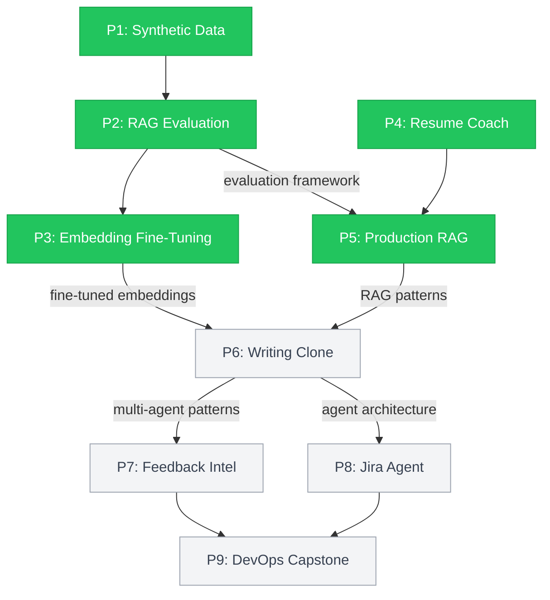

# AI Engineering Portfolio

Nine AI projects built end-to-end from February to May 2026, spanning data pipelines, retrieval systems, evaluation frameworks, and multi-agent architectures. Not API wrappers. Each project solves a real engineering problem with measurable outcomes, reproducible from committed code.

[LinkedIn](https://linkedin.com/in/jharuby) · [Portfolio Site](https://rubyjha.dev)

## Completed Projects

### P1: Closed-Loop Synthetic Data Pipeline

Generates synthetic Home DIY Repair Q&A data and validates it through a 4-stage correction pipeline (V1 generation, individual correction, V2 template improvement, final correction). Improving prompt templates upstream cut failures by 78%. Individual record correction only managed 67%. Fixing the system beats fixing individual outputs.

**Result:** 36 failures → 0 across 4-stage correction pipeline · 81.7% inter-rater agreement (manual vs LLM-as-Judge)

`Python` `Pydantic` `OpenAI` `Instructor` `Streamlit`

[](https://github.com/rubsj/ai-synthetic-data-generator)

### P2: RAG Evaluation Benchmarking Framework

16-configuration grid search across chunking strategies, embedding models, and reranking pipelines. Evaluated with a 4-judge pipeline (correctness, hallucination, relevance, Bloom taxonomy). Reranking was the single biggest quality lever. OpenAI embeddings outperformed local models by 26%, and at $0.02/1M tokens the cost argument for local-only fell apart.

**Result:** Recall@5 0.625 → 0.747 (+19.5%) with Cohere reranking · 557 tests · 5 ADRs

`Python` `FAISS` `LangChain` `Sentence-Transformers` `RAGAS` `Cohere` `Braintrust` `Streamlit`

[](https://github.com/rubsj/ai-rag-evaluation-framework)

### P3: Contrastive Embedding Fine-Tuning

Pre-trained embeddings ranked dating compatibility pairs backwards (Spearman = -0.22). Applied contrastive fine-tuning with LoRA and benchmarked across 8 metrics. LoRA hit 96.9% of standard fine-tuning performance with 0.32% trainable parameters.

**Result:** Spearman -0.22 → +0.85 · AUC-ROC 0.994 · False positives 137 → 3

`Python` `Sentence-Transformers` `PEFT/LoRA` `Matplotlib` `Seaborn`

[](https://github.com/rubsj/ai-contrastive-embedding-finetuning)

### P4: AI-Powered Resume Coach

Production pipeline that generates 250+ resume-job pairs across 5 fit levels and 5 prompt templates, scores them through 5 rule-based failure metrics and GPT-4o-as-Judge, and serves results via 9 FastAPI endpoints with ChromaDB semantic search. Template A/B testing revealed casual templates failed validation 34% of the time. career_changer templates failed 100%. Prompt design matters, and chi-squared proved it.

**Result:** Chi-squared = 32.74 (p<0.001) · 66-point failure spread across templates · 532 tests · 99% coverage

`Python` `OpenAI` `Instructor` `Pydantic` `ChromaDB` `FastAPI` `Streamlit`

[](https://github.com/rubsj/ai-resume-coach)

### P5: ShopTalk Knowledge Management Agent

First-principles production RAG system built from abstract base classes, no LangChain. 5 chunking strategies, 4 embedding models (including local Ollama), hybrid retrieval (dense + BM25 with score fusion), cross-encoder reranking, and a 5-axis LLM-as-Judge. Heading-aware semantic chunking dominated all 46 configurations. Local embeddings via Ollama landed within 0.14 NDCG@5 of OpenAI quality at zero API cost. Every configuration decision traces back to a specific experiment result.

**Result:** NDCG@5 0.896 · Judge average 4.77/5.0 · 46 configurations benchmarked · Reproducibility verified (0% variance) · 627 tests · 97% coverage · 7 ADRs

`Python` `PyMuPDF` `FAISS` `Sentence-Transformers` `rank-bm25` `LiteLLM` `Cohere` `Ollama` `Instructor` `Pydantic` `Click` `Streamlit` `YAML`

[](https://github.com/rubsj/ai-shoptalk-knowledge-agent)

## Upcoming Projects

### P6: Digital Writing Clone

Multi-agent writing style clone with CrewAI. StyleAnalyzer extracts sentence-length distributions, vocabulary richness, and transition patterns from writing samples. RAGAgent grounds generated content in domain knowledge. EvaluatorAgent scores output on style similarity and groundedness. PlannerAgent orchestrates the crew. Weighted scoring formula (Style × 0.4 + Groundedness × 0.4 + Confidence × 0.2) with sensitivity analysis across parameter variations.

`Python` `CrewAI` `OpenAI` `Sentence-Transformers`

[](https://github.com/rubsj/ai-digital-clone)

### P7: Customer Feedback Intelligence

CrewAI-powered feedback analysis pipeline. SentimentAgent classifies pain intensity, not just polarity. ThemeAgent clusters feedback via embeddings instead of LDA (better for short text). MappingAgent aligns themes to product roadmap taxonomy. GapAgent finds feedback themes with zero roadmap coverage. Output is a prioritized list of unaddressed customer pain points.

`Python` `CrewAI` `scikit-learn` `HDBSCAN`

[](https://github.com/rubsj/ai-feedback-intelligence)

### P8: Jira AI Agent

AI-powered Jira assistant with semantic search over issue history (cosine similarity with tuned threshold), duplicate detection before ticket creation, and sprint planning informed by velocity distributions instead of single-point estimates. CLI-first with Click.

`Python` `CrewAI` `ChromaDB` `FastAPI`

[](https://github.com/rubsj/ai-jira-agent)

### P9: DevOps AI Assistant (Capstone)

Five-agent DevOps system. PipelineMonitor consumes CI/CD events. LogAnalyzer separates signal from noise in structured logs. RootCause agent combines LLM reasoning with knowledge base retrieval. Remediation agent generates context-aware fix suggestions with risk-level gating. KnowledgeBase agent builds institutional memory from resolved incidents. The hardest part is the error taxonomy: classifying failure modes before writing any code.

`Python` `CrewAI` `Kubernetes` `Prometheus`

[](https://github.com/rubsj/ai-devops-assistant)

## How the Projects Connect



## Portfolio Stats

- 2,000+ tests across P1-P5
- 24 ADRs documenting every non-obvious decision
- 94%+ code coverage on all completed projects
- Every result reproducible from committed code with pinned seeds and model versions

## Quick Setup

Clone all project repos as siblings:

```bash
curl -sL https://raw.githubusercontent.com/rubsj/ai-portfolio/main/clone-all.sh | bash
```

Or clone individually from the repo links above. A VS Code workspace file is included for multi-root development.

---

Built by [Ruby Jha](https://linkedin.com/in/jharuby) · 20+ years software engineering · 7+ years engineering management at State Street, EY, HSBC, and Centene
