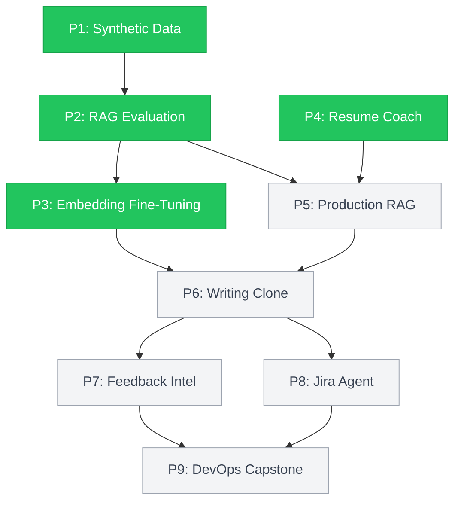

# AI Portfolio — 9 Projects in 8 Weeks

> Production-grade AI systems with measurable results, not toy demos.


---

Engineering leader with 20+ years building enterprise platforms and 7+ years managing globally distributed teams of up to 12 engineers in Financial Services (State Street, HSBC) and Healthcare (Centene). Scaled platforms to 40+ enterprise customers, owned $106K/month contractor budgets, and delivered $250K/month in operational savings across organizations spanning US, India, and Poland. This portfolio is a deliberate 8-week sprint (Feb–Apr 2026): 9 production-grade AI systems built end-to-end to go beyond AI familiarity and into AI leadership — technical depth sufficient to set architecture direction, evaluate trade-offs, and lead AI engineering teams. Every project ships with measurable outcomes, Architecture Decision Records, and 95%+ test coverage — the same standards I hold teams to.

**4/9 Projects Complete** · **1,100+ Tests** · **17 ADRs** · **95%+ Coverage** · **~20 PRs** · **Total LLM Cost: [TODO: $XX]**

## Stack Progression



Nine projects spanning the full AI engineering stack — from data quality foundations through multi-agent production systems. Each layer deliberately builds on the previous.

## Projects

| # | Project | Status | Key Techniques | Links |
|---|---------|--------|----------------|-------|
| 1 | [Synthetic Data — Home DIY Repair](./01-synthetic-data-home-diy/) | ✅ Complete | Structured generation, LLM-as-Judge, correction loop, 5-layer validation | [README](./01-synthetic-data-home-diy/README.md) · Demo & Loom: Week 8 |
| 2 | [Evaluating RAG for Any PDF](./02-rag-evaluation/) | ✅ Complete | 16-config grid search, hybrid reranking, RAGAS metrics, faithfulness analysis | [README](./02-rag-evaluation/README.md) · Demo & Loom: Week 8 |
| 3 | [Contrastive Embedding Fine-Tuning](./03-fine-tuning-guardrails/) | ✅ Complete | CosineSimilarityLoss, LoRA/PEFT, 8-metric eval framework, UMAP clustering | [README](./03-fine-tuning-guardrails/README.md) · Demo & Loom: Week 8 |
| 4 | [AI-Powered Resume Coach](./04-resume-coach/) | ✅ Complete | Synthetic resumes, A/B template testing (χ²=32.74), ChromaDB vector search | [README](./04-resume-coach/README.md) · Demo & Loom: Week 8 |
| 5 | [Production RAG System](./05-production-rag/) | ⏳ Upcoming | Multi-strategy chunking, hybrid search, Cohere reranking, REST API | — |
| 6 | [Digital Writing Clone — 5-Agent](./06-digital-writing-clone/) | ⏳ Upcoming | StyleAnalyzer, RAG, Evaluator, Fallback, Planner agents | — |
| 7 | [Customer Feedback Intelligence](./07-feedback-intelligence/) | ⏳ Upcoming | CrewAI pipeline: Sentiment, Theme, Mapping, Gap agents | — |
| 8 | [Jira AI Agent](./08-jira-ai-agent/) | ⏳ Upcoming | Semantic search, duplicate detection, sprint planning | — |
| 9 | [DevOps AI Assistant (Capstone)](./09-devops-assistant/) | ⏳ Upcoming | 5-agent system: CI/CD monitoring, log analysis, root cause, remediation | — |

## Completed Project Highlights

### P1 — Synthetic Data: Home DIY Repair

**Problem:** LLM-generated training data is only useful if it's validated — most pipelines skip this step.

**Approach:** Built a 5-layer validation pipeline (schema → semantic → LLM-as-Judge → correction loop → re-evaluation) to generate 30 structured QA records across 5 repair categories × 2 formats × 3 difficulty levels.

**Key Results:**
- 100% generation success rate, zero schema validation failures (Pydantic + Instructor)
- LLM-as-Judge calibrated from 0% → 20% failure detection via prompt engineering
- 78% failure reduction V1 → V2 — upstream prompt improvement outperformed downstream correction

**Engineering:** 4 ADRs · 7 publication-quality charts · 6-page Streamlit Story Mode

→ [Project README](./01-synthetic-data-home-diy/README.md) · Demo & Loom: Week 8

---

### P2 — Evaluating RAG for Any PDF

**Problem:** RAG systems have dozens of configuration knobs but no systematic way to know which settings actually matter.

**Approach:** Ran a 16-configuration grid search across chunking strategies, embedding models, and reranking — producing a reusable benchmarking framework applicable to any PDF corpus.

**Key Results:**
- Best config: semantic chunking + OpenAI embeddings → Recall@5 = 0.625; +19.5% with Cohere reranking (→ 0.747)
- OpenAI embeddings outperform local models by 26% for $0.02/1M tokens; BM25 beaten by 10 of 15 vector configs
- Faithfulness gap of 0.511 and 39% LLM refusal rate misclassified as hallucinations — retrieval ≠ generation quality

**Engineering:** 384+ tests · 5 ADRs · 95% coverage · Click CLI with Rich formatting

→ [Project README](./02-rag-evaluation/README.md) · Demo & Loom: Week 8

---

### P3 — Contrastive Embedding Fine-Tuning

**Problem:** Pre-trained embeddings encode generic similarity — they can't distinguish domain-specific compatibility from surface overlap.

**Approach:** Applied contrastive fine-tuning (CosineSimilarityLoss) to flip inverted embeddings, then benchmarked standard vs. LoRA (PEFT) fine-tuning using an 8-metric evaluation framework spanning Spearman, AUC-ROC, Cohen's d, and cluster purity.

**Key Results:**
- Spearman flipped -0.22 → +0.85; margin improved 1,238%: -0.083 → +0.940 (AUC-ROC 0.994, Cohen's d 7.73)
- LoRA: 96.9% of standard performance with 0.32% trainable parameters and a 300x smaller model file
- 97.8% false positive reduction: 137 → 3 FPs

**Engineering:** 112 tests · 3 ADRs · memory-constrained fine-tuning on 8GB M2 (drove LoRA over full training)

→ [Project README](./03-fine-tuning-guardrails/README.md) · Demo & Loom: Week 8

---

### P4 — AI-Powered Resume Coach

**Problem:** Resume screening tools score holistically but can't tell you *why* a resume fails or *which template* works best.

**Approach:** Generated 250 synthetic resumes across 5 fit levels and 5 writing templates, applied GPT-4o-as-Judge scoring with Instructor retry loops, and ran a statistically rigorous A/B test — backed by a FastAPI service and ChromaDB vector store.

**Key Results:**
- Jaccard gradient confirmed: excellent=0.669 → mismatch=0.005 — skill overlap is the dominant fit signal
- A/B test: casual template (34% failure) vs career_changer (100%) — χ²=32.74, p<0.001, 66-point spread
- 8/8 judge corrections via Instructor retry loop (100% correction rate)

**Engineering:** 532 tests · 5 ADRs · 99% coverage · 9 FastAPI endpoints + ChromaDB vector store

→ [Project README](./04-resume-coach/README.md) · Demo & Loom: Week 8

---

## How I Build

**Validation-First Development.** Every project runs a 5-layer validation methodology: schema validation (Pydantic), semantic checks, LLM-as-Judge scoring, correction loops, and re-evaluation against a fixed baseline. The P4 insight: aggregate metrics can hide fundamental data format issues — a 20% judge failure rate traced back to prompt calibration, not data quality. These patterns came from building, not from reading about them.

**Architecture Decision Records.** 17 ADRs across 4 projects. Every non-obvious choice is documented with context, alternatives considered, and rationale. The standard: if I got hit by a bus, any engineer could understand *why* the system works this way — not just *what* it does. ADRs include a Java/TS parallel for each decision, since these patterns are being built on genuinely new terrain.

**LLM Cost Discipline.** MD5-keyed disk caching for all LLM calls; cost estimated and logged per call; model selection based on task complexity (GPT-4o-mini for generation, GPT-4o for evaluation). Total portfolio spend: [TODO: $XX]. EMs notice when engineers treat compute as free.

**Reproducible Results.** Seeds, model versions, and evaluation configs are all pinned and committed. Any result in any project README can be regenerated from committed code — no "it worked last Tuesday" results.

**Hardware-Constrained Engineering.** Everything runs on a MacBook Air M2 with 8GB RAM. Memory management isn't theoretical — it drove real architectural decisions: LoRA over full fine-tuning in P3 (300x smaller model file), streaming evaluation in P2, and batch size tuning throughout. Constraints are forcing functions for better architecture.

## Repository Structure

```
ai-portfolio/
├── 01-synthetic-data-home-diy/   # P1: Structured generation + LLM-as-Judge validation
├── 02-rag-evaluation/            # P2: 16-config retrieval benchmarking
├── 03-fine-tuning-guardrails/    # P3: Contrastive + LoRA embedding fine-tuning
├── 04-resume-coach/              # P4: Synthetic data pipeline + FastAPI + ChromaDB
├── 05-production-rag/            # P5: Production-grade RAG with hybrid search
├── 06-digital-writing-clone/     # P6: 5-agent writing style system
├── 07-feedback-intelligence/     # P7: Multi-agent feedback analysis pipeline
├── 08-jira-ai-agent/             # P8: Semantic search + sprint planning agent
├── 09-devops-assistant/          # P9: 5-agent DevOps automation (Capstone)
├── shared/                       # Cross-project utilities
├── docs/                         # Cross-project ADRs, learning notes
└── CLAUDE.md                     # Persistent engineering context
```

## Tech Stack

| Category | Tools | Why |
|----------|-------|-----|
| **LLM & AI** | OpenAI API (GPT-4o-mini / GPT-4o), Instructor, Cohere Rerank | Structured output guarantees (Instructor); cost-tiered model selection |
| **Embeddings** | Sentence-Transformers, PEFT/LoRA | Local fine-tuning on memory-constrained hardware |
| **Vector & Search** | FAISS, ChromaDB | FAISS for benchmarking (no server), ChromaDB for production (persistence + metadata) |
| **Evaluation** | RAGAS, Braintrust | Industry-standard RAG metrics + experiment tracking |
| **Frameworks** | LangChain, CrewAI, FastAPI | RAG orchestration, multi-agent systems, production APIs |
| **Validation** | Pydantic v2 | Schema-enforced data contracts for LLM outputs |
| **Frontend** | Streamlit, Rich, Matplotlib, Seaborn | Rapid demos, CLI formatting, publication-quality charts |
| **DevOps** | Click CLI, pytest, ruff, uv, GitHub Actions | CLI-first workflows, fast linting, modern package management |

---

**Connect:** [LinkedIn](https://linkedin.com/in/jharuby) · [Portfolio Site](https://rubyjha.dev)

Built entirely on MacBook Air M2 (8GB RAM) · Total LLM cost: [TODO: $XX] · Live demos and Loom walkthroughs shipping Week 8
